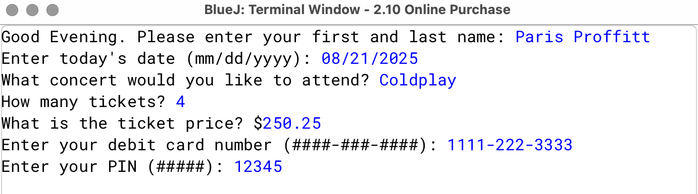
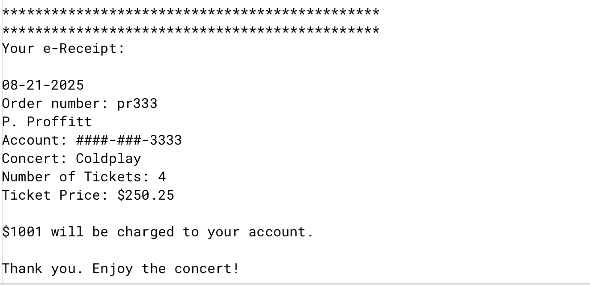

# Project Name: OnlinePurchase

## Description
This project is part of my AP Computer Science A coursework.  
It is a Java program that simulates buying concert tickets online. It uses user input to perform calculations and display ticket information.

## Features
- Prompts the user to enter the number of tickets and ticket type.
- Calculates the total cost.
- Displays a summary of the purchase.
- Includes validation for user input.

## How to Run
1. Open the project in BlueJ.
2. Compile all classes.
3. Run the main class (`BuyConcertTickets`).
4. Enter the required input when prompted.
5. View the purchase summary output.

## Screenshots

## Notes
- This project was completed using BlueJ.
- All source code is written in Java.

